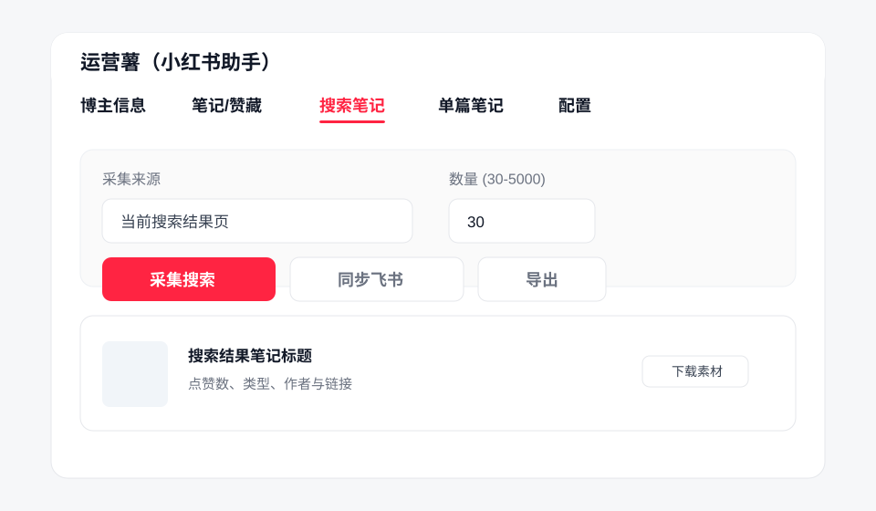
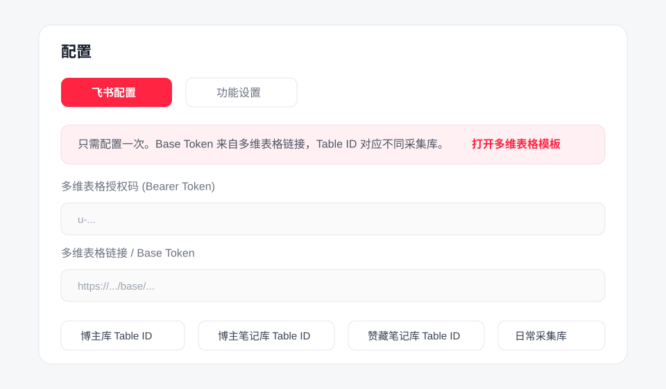

# 运营薯（小红书助手）

一个免费的 Chrome 扩展，用于在小红书网页端采集博主、笔记、搜索结果和个人赞藏数据，并支持导出 Excel 或同步到飞书多维表格。

## 功能

- 博主信息采集：昵称、主页介绍、粉丝数、关注数、获赞与收藏数、头像等。
- 博主笔记采集：批量采集博主主页笔记列表，支持数量控制、勾选、排序、导出和同步。
- 搜索笔记采集：在小红书搜索结果页批量采集当前关键词下的笔记，适配滚动加载。
- 单篇笔记采集：采集标题、正文、作者、互动数据、发布时间、标签、图片和视频链接。
- 赞藏管理：采集个人收藏/点赞列表，支持勾选后批量取消收藏或取消点赞。
- 素材下载：支持下载封面、图片和视频素材。
- 飞书同步：支持同步到飞书多维表格，并可选上传图片附件。
- 快捷采集：小红书笔记页提供悬浮按钮，可快速写入日常采集库。

## 安装

1. 下载或克隆本仓库。
2. 打开 Chrome，进入 `chrome://extensions/`。
3. 开启右上角“开发者模式”。
4. 点击“加载已解压的扩展程序”。
5. 选择本项目目录。
6. 点击浏览器工具栏里的“运营薯”图标打开侧边栏。

## 界面预览

## 飞书配置

扩展支持把采集结果写入飞书多维表格。可以使用模板快速开始：

- 多维表格模板：https://zinxkclpk97.feishu.cn/wiki/McHKwqoogiOpIik5cC8cJqt3nQe?table=blk0FFUqida7Qqri
- 使用说明：https://zinxkclpk97.feishu.cn/wiki/KMMXwMwK6iheNukf2bkcJNcUnQe

需要在扩展的“配置”页填写：

- 多维表格授权码：`Bearer Token`
- 多维表格链接或 `Base Token`
- 博主库 `Table ID`
- 博主笔记库 `Table ID`
- 赞藏笔记库 `Table ID`
- 日常采集库 `Table ID`

如果只使用本地导出，可以不配置飞书。

## 使用

### 博主信息

1. 打开小红书博主主页。
2. 在扩展中进入“博主信息”页签。
3. 点击“采集主页”。
4. 可选择同步到飞书。

### 笔记/赞藏

1. 打开小红书博主主页或自己的主页。
2. 进入“笔记/赞藏”页签。
3. 选择“博主笔记”“收藏笔记”或“点赞笔记”。
4. 设置数量后点击“开始采集”。
5. 采集后可勾选记录、导出、同步；收藏/点赞列表支持批量取消。

### 搜索笔记

1. 打开小红书搜索结果页，例如 `https://www.xiaohongshu.com/search_result_ai?keyword=...`。
2. 进入“搜索笔记”页签。
3. 设置数量后点击“采集搜索”。
4. 扩展会按搜索接口和页面滚动结果采集数据。

### 单篇笔记

1. 打开小红书笔记详情页。
2. 进入“单篇笔记”页签。
3. 点击“采集当前笔记”。
4. 可下载素材或同步到飞书。

## 频率设置

在“配置”页可以设置采集、同步、取消赞藏操作的随机间隔。批量操作建议使用较慢间隔，减少触发平台风控的概率。

## 技术栈

- Chrome Extension Manifest V3
- Side Panel API
- Vanilla JavaScript
- HTML / CSS
- 飞书多维表格 Open API

## 免责声明

本项目仅用于个人内容管理和效率提升。使用者应遵守小红书、飞书及相关平台的服务条款，自行承担使用风险。
